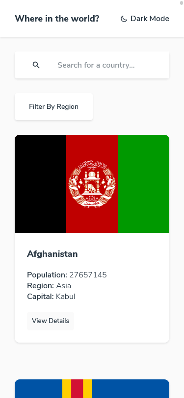
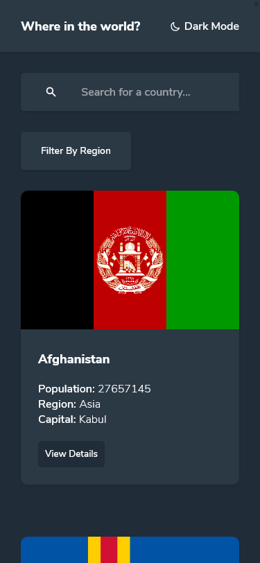
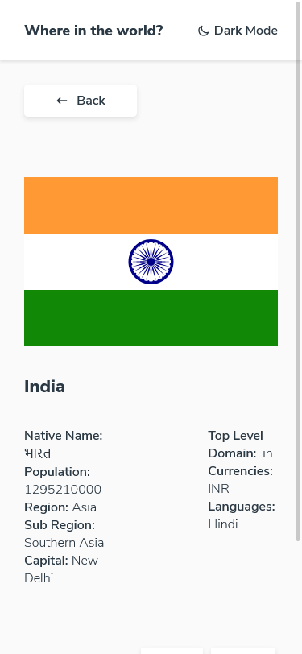
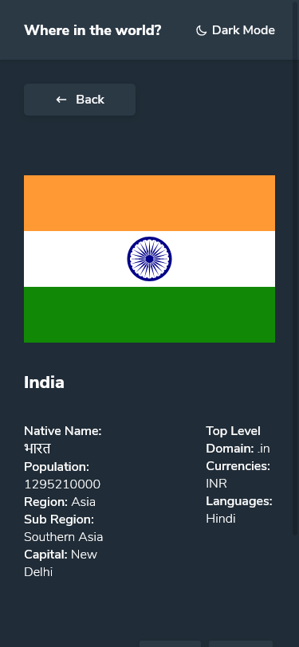
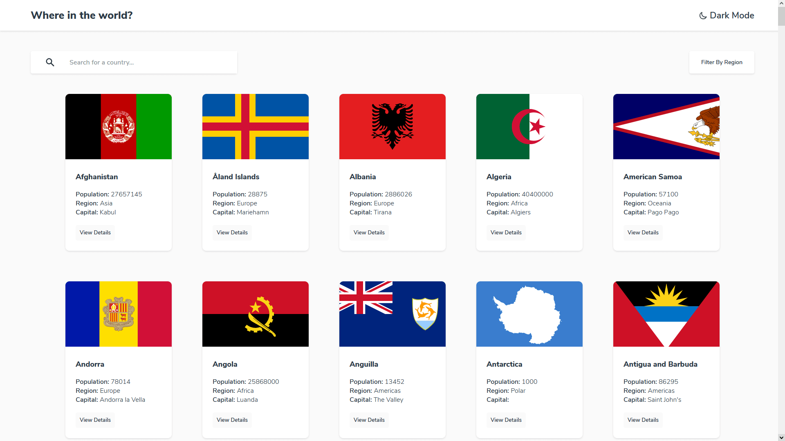
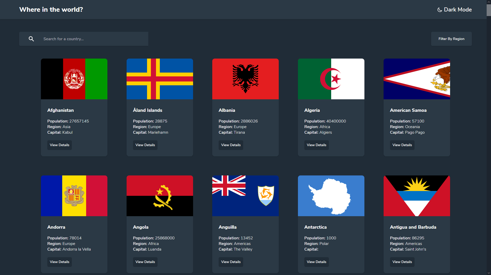
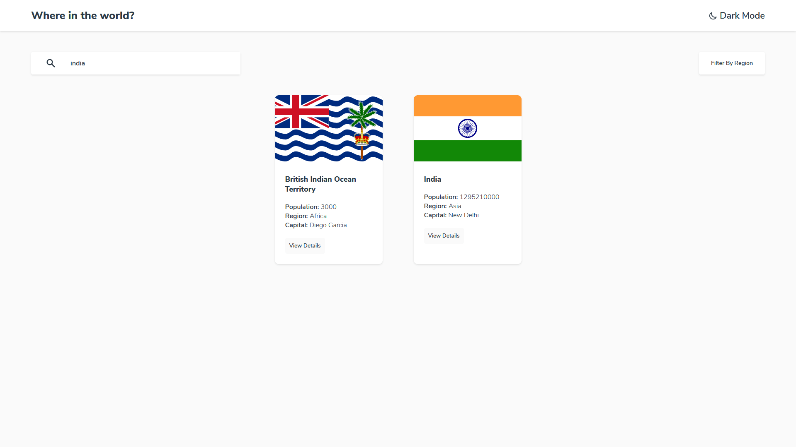
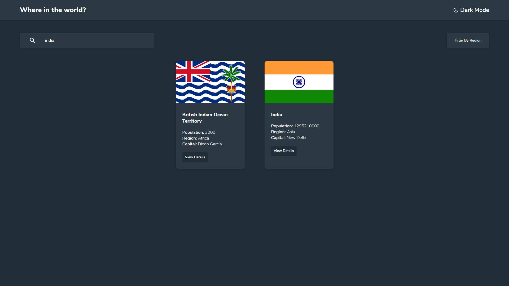
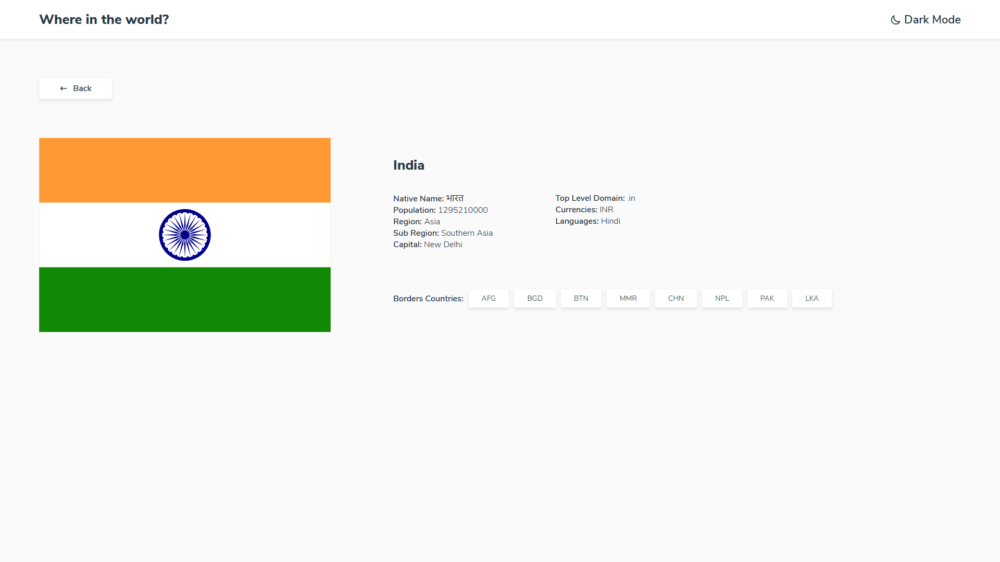
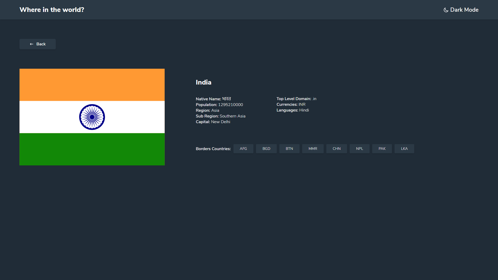

# Frontend Mentor - REST Countries API with color theme switcher solution

This is a solution to the [REST Countries API with color theme switcher challenge on Frontend Mentor](https://www.frontendmentor.io/challenges/rest-countries-api-with-color-theme-switcher-5cacc469fec04111f7b848ca). Frontend Mentor challenges help you improve your coding skills by building realistic projects. 

## Table of contents

- [Overview](#overview)
  - [The challenge](#the-challenge)
  - [Screenshot](#screenshot)
  - [Links](#links)
- [My process](#my-process)
  - [Built with](#built-with)
  - [What I learned](#what-i-learned)
  - [Continued development](#continued-development)
  - [Useful resources](#useful-resources)
- [Author](#author)
- [Acknowledgments](#acknowledgments)

**Note: Delete this note and update the table of contents based on what sections you keep.**

## Overview

### The challenge

Users should be able to:

- See all countries from the API on the homepage
- Search for a country using an `input` field
- Filter countries by region
- Click on a country to see more detailed information on a separate page
- Click through to the border countries on the detail page
- Toggle the color scheme between light and dark mode *(optional)*

### Screenshot


#### Mobile

&nbsp;

&nbsp;

&nbsp;

&nbsp;

<br/>

#### Desktop

&nbsp;

&nbsp;

&nbsp;

&nbsp;

&nbsp;

&nbsp;

### Links

- Solution URL: [Add solution URL here](https://github.com/thesohailjafri/Where-in-the-world)
- Live Site URL: [Add live site URL here](https://fm-where-in-the-world.netlify.app/)

## My process

### Built with

- Semantic HTML5 markup
- SCSS custom properties
- Flexbox
- CSS flex-box
- Desktop-first workflow
- [React](https://reactjs.org/) - JS library


### What I learned
1) In this project i have revisied my React leasons and first time tried class based component approach.
2) Learn about Callback function and Debounce function.
2) Tried Custom Styled Component for Dark Theme.

To see how you can add code snippets, see below:

```html
<h1>Custom Styled Component</h1>
```

```js
   const style1 = {
        'background-color': props.data.theme.element,
        'color': props.data.theme.text,
    }

    const style2 = {
        'background-color': props.data.theme.background,
        'color': props.data.theme.text,
    }
```

```html
<h1>Callback Function</h1>
```

```js
    switchMode = () => {
    this.setState({
      mode: !this.state.mode
    }, () =>
      this.applyTheme()
    )
  }
```

### Continued development

In futher development i will improve 'invalid url' exception handling and try to optimized the UX of project.

### Useful resources

- [https://www.youtube.com/watch?v=6EDhZHsRY4k](https://www.example.com) - This helped me for bebounce


## Author

- Website - [thesohailjafri](https://www.thesohailjafri.com/)
- Frontend Mentor - [@thesohailjafri](https://www.frontendmentor.io/profile/thesohailjafri/)
- Instagram - [@thesohailjafri](https://www.instagram.com/thesohailjafri/)

